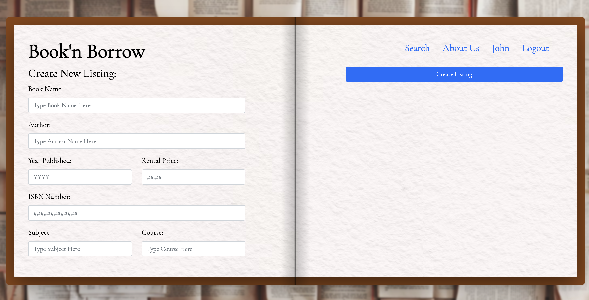
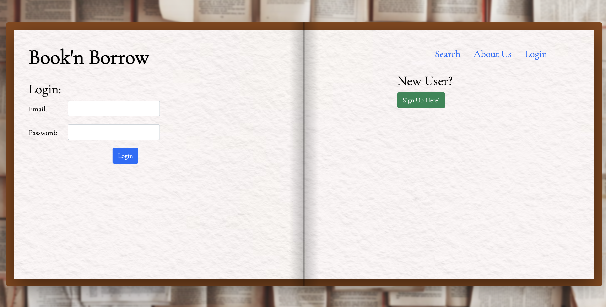
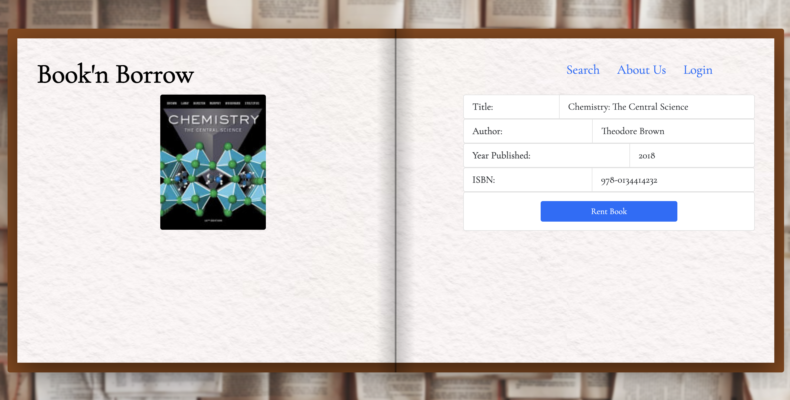
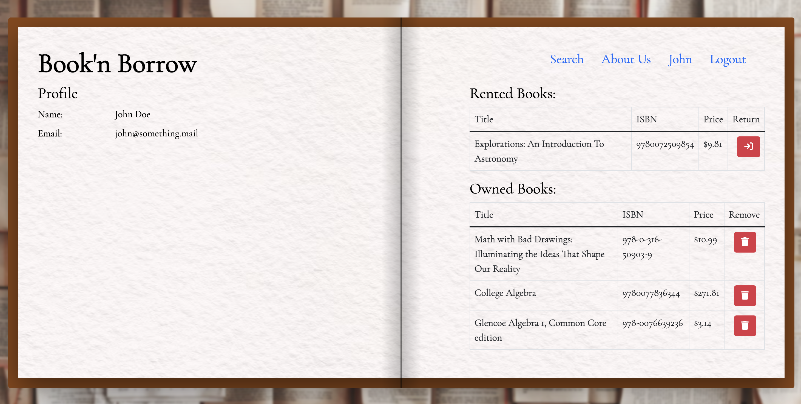
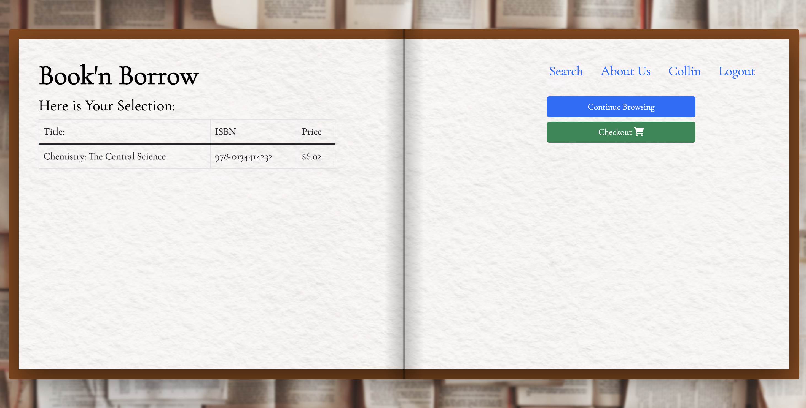

# Project 2: Book'n Borrow
Book'n Borrow is a website designed to give users the option to loan out old college textbooks that they are no longer using and to make money by loaning the book. It also allows a user to be able to search for and be able to rent out textbooks that they may need for their courses.

## Description

### User Story
```
AS A current college/university student
I WANT to rent textbooks required for my classes
SO THAT I do not have to pay large amounts of money for a textbook
```

```
AS A current or former college/university student
I WANT to be able to rent out my old textbooks
SO THAT I can make money from old textbooks that I'm not using and to help out new students
```
### Acceptance Criteria
```
GIVEN a website to rent or loan out college/university textbooks
WHEN I get to the main landing page
THEN options to search for books to loan or create a book listing are presented
WHEN I click on the renter option
THEN a search page is loaded where I can use parameters to find the textbook I need
WHEN I found the textbook I need and click the checkout button
THEN I am taken to a page where I can enter my payment option and shipping information
WHEN I click on the loan option
THEN a page where I can create a new book listing with multiple inputs
THEN the listing is stored and made available for others to search for
WHEN I click the login button at the top of the page in the navigation bar
THEN the ability to login with my and password is made
WHEN I am not a user and I click on the login button
THEN the inputs to create a profile are now available
WHEN I click a sign up button
THEN my account credentials be stored in a server database
```

## Technologies Used
* Google Fonts
* Bootstrap
* w3slley Bookcover API
* JavaScript
* CSS
* Node.js
* Express.js
* Handlebars.js
* Sequelize
* MySQL
* Jira
* Figma
* GitHub
* Heroku

## Screenshot of Deployed Application









## Link to Deployed Application
https://booknborrow.herokuapp.com/

---
